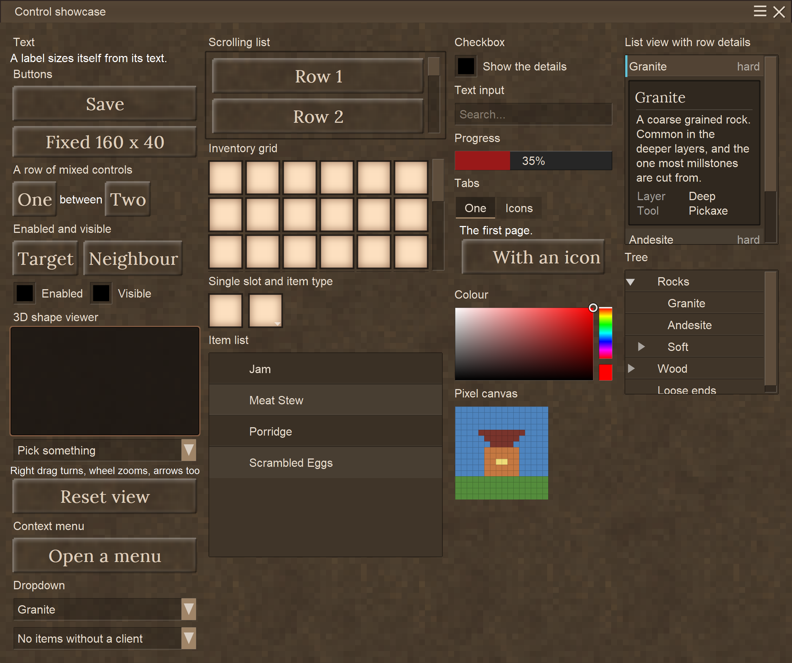
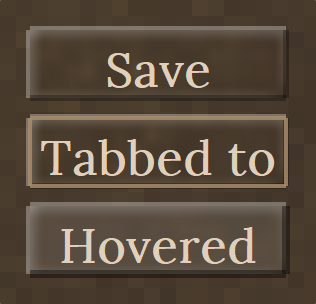
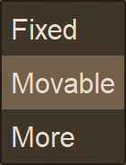
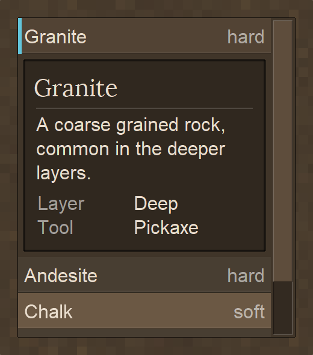
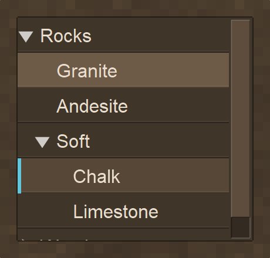

<h1>Hello there :)</h1>

This is an approach to fix the current GUI system for Vintage Story.
The core idea of this framework is a stack-container based way to structure and maintain a user
interface. For now I call it **Modern Vintage Story UI**, or **MVS_UI** for short.



*Every control in one dialog. This picture is rendered from the same code the test hotkey opens
in game, so it cannot show a screen that no longer exists.*

> **Full documentation:** the [wiki](https://github.com/DrakenRolle/ModernVintageGUI/wiki) - every
> control in detail, the layout rules, GUI scale, events, focus and depth, and how to write your
> own control.

<h2>Goals of this Project</h2>

* Make a more modder friendly approach to building user interfaces
  * Achieved by letting the developer only define the data he wants to show, and letting this API
    handle positioning, sizing and order
  * Control focused approach like in other .NET UI frameworks - WinForms, WPF, UWP and so on
* Dialog scaling and control positioning should work independently of GUI scale or window size
* <b>UI DESIGNER :D</b>
  * There is one - `ZUIDesigner`, in the browser. Drag controls into the dialog, see it drawn by
    the framework's own code, and get the markup or the C# back out. The WPF idea turned into a
    Blazor one for the same reason the harness exists: it can run the real layout without the game
* XML exportable format - and the designer edits that XML rather than a model of its own
* Easy to implement custom controls
* Long term sustainability by decoupling this system from the vanilla one as far as possible, so
  game updates do not break all the user interfaces
* Long term thought: fixed positioning reintegrated, but compatible with the designer

<h2>What is included in here</h2>

* **Own parenting and positioning system**, not attached to `ElementBounds`
* **Autosizing** from content - containers from their children, text labels from their text and font
* **Repeatable layout.** Measure and arrange are separated, so laying the same tree out twice gives
  the same answer. That is what makes reopening a dialog and editing it at runtime safe
* **Proper GUI scale support.** Everything you specify is in unscaled author units, exactly like
  `GuiElement.scaled()` in vanilla. Moving the GUI scale slider updates open dialogs live
* **Real mouse capture.** The cursor is released while a dialog is open, clicks are consumed by the
  dialog instead of reaching the world, and block interaction is suppressed
* **Focus driven z-order.** A focused dialog draws above the vanilla GUI and takes clicks in the
  overlap; an unfocused one goes back below it - the same rule the game applies to its own windows
* **Keyboard focus.** Tab and the arrow keys walk the interactive controls in reading order, Enter
  and Space activate the focused one, Escape closes the dialog. Only the keys that actually did
  something are consumed, so the game stays playable with a dialog open
* **Dynamic recomposing** after the UI was opened, so you can change and edit the UI as you like
  even if the dialog is already open
* **Decoupled rendering.** The control tree draws itself onto a single Cairo surface which is
  uploaded once per refresh; the vanilla GUI system is only used where it actually helps
* **A headless layout harness** that renders the UI to PNG and checks the layout invariants without
  starting the game
* **A visual designer in the browser**, built on that same headless rendering. Drag controls into
  the dialog, drop them into the container and the row you can see, and get XML markup or C# back

* **Clipping and scrolling.** A container can cut what its children draw at its own edge, and any
  container can grow a vanilla styled scrollbar on either axis - the bars hang on the container
  rather than being controls of their own
* **Real inventories.** An inventory grid is a view of an actual inventory the server knows about,
  so items move between it and the player's bag, a chest or the creative inventory exactly as they
  move between two vanilla grids - including the item tooltip and shift click
* **Inventory events** that report what changed and what was there before, whoever changed it - a
  click in the grid, a shift click from elsewhere, a hopper, another player, or the server
* **Text input** with the keyboard layout applied, so umlauts, accents and dead keys work. The
  game offers typed characters to nothing but its own dialogs, so this takes a Harmony patch of
  its own
* **Two drawing passes.** The control tree goes onto one Cairo surface, and anything that cannot -
  an item stack, drawn from the item atlas with its own shader - is drawn on top per frame, the
  same split the vanilla GUI makes

* **One kind of list row.** A dropdown entry, a list view row and a tree node are the same control
  underneath (`ListRowControl`), so the banding, the hover, the icon column and the item tooltip
  are decided once rather than three times - and a list, a tree and a menu read as one family

**Controls so far:** `RectangleControl`, `TextLabelControl`, `ButtonControl`, `ContextMenuControl`,
`TitleBarControl`, `ItemSlotControl`, `InventoryGridControl`, `DropdownControl`,
`ItemTypeSelectorControl`, `CheckboxControl`, `TextInputControl`, `ProgressBarControl`,
`TabsControl`, `ImageControl`, `ColorPickerControl`, `PixelCanvasControl`, `ListViewControl`,
`ItemListViewControl`, `DetailViewControl`, `TreeViewControl`.

<h2>What is still ongoing</h2>

* `Orientation` (a control's own alignment) is inert, and `Orientation.Fill` is not implemented
* Redraw invalidation - every hover state change still redraws the whole surface. On the showcase
  that is ~9 ms at GUI scale 1 and ~19 ms at scale 2, most of it now the text. The way out is the
  one vanilla takes and `ItemSlotControl` already takes here: compose an element once into a
  surface of its own and blit it. Measure before you guess - see `--profile`
* Re-centering on window resize
* XAML editor or custom UI designer
* More styling options (custom backgrounds, fonts)
* Text field extras - selecting a range, cut and paste, and a blinking caret
* Edge drag resize window

<h1>Getting started</h1>

<h2>Setup</h2>

Declare MVS_UI as a dependency in your `modinfo.json`:

```json
"dependencies": {
    "game": "1.22.0",
    "modernvintagegui": "1.0.0"
}
```

And add it as a Reference to your Mod Project.

That is all - MVS_UI initialises itself. **Do not** apply its Harmony patches or create a
`UIManager` in your own mod, and **do not** bundle a copy of the assembly; see
[why](https://github.com/DrakenRolle/ModernVintageGUI/wiki/Input-Focus-and-Rendering).

<h2>A dialog</h2>

```csharp
var dialog = new CustomDialogElement(capi, "MyTestDialog", "My Title");

var text = new TextLabelControl("Hi im Fancy!");
dialog.Children.Add(text);

dialog.Show();
```


<h2>Buttons</h2>

```csharp
var save = new ButtonControl(_Name: "saveButton");
save.Text = "Save";
save.Clicked += (sender, e) => capi.ShowChatMessage("Save clicked");
dialog.Children.Add(save);
```


<h2>Stacking</h2>

A container stacks its children along `InsideOrientation` - `Top` (the default) downwards, `Left`
sideways.

```csharp
var row = new RectangleControl();
row.InsideOrientation = Orientation.Left;

foreach (string caption in new[] { "One", "Two", "Three" })
{
    var button = new ButtonControl();
    button.Text = caption;
    row.Children.Add(button);
}

dialog.Children.Add(row);
```


Controls of different kinds mix freely in one row:


<h2>Keyboard</h2>

Tab and the arrow keys move the focus, Enter and Space activate, Escape closes. Controls the
player operates are in the tab order; decoration is not.

```csharp
var button = new ButtonControl { Text = "Save" };   // focusable already
myPanel.IsFocusable = false;                        // and containers are not

dialog.CloseOnEscape = false;                       // for a dialog that must be dismissed on purpose
```



Hover and focus are separate states, so a control can be in both. Nothing is focused when a dialog
opens, which means Enter and Space stay with the game until the player tabs into the dialog or
clicks a control.

A text field takes every key while it is focused, so typing does not trigger the game's hotkeys -
Escape still leaves, because a dialog you cannot escape from is a trap:

```csharp
var search = new TextInputControl { PlaceholderText = "Search..." };
search.TextChanged  += (s, text) => Filter(text);
search.EnterPressed += (s, text) => Submit(text);
```

<h2>Context menus</h2>

A menu hangs on any control, positions itself at an anchor and supports cascades. One subscription
sees picks from every level.

```csharp
var menu = new ContextMenuControl(button, items, "positionMode", ContextMenuAnchor.BottomLeft);
button.Clicked += (sender, e) => menu.Toggle();

menu.ItemActivated += (sender, e) => capi.ShowChatMessage(string.Join(" > ", e.Path.Select(i => i.Text)));
```



<h2>Inventories</h2>

An inventory grid shows a real inventory. Not a copy and not a client side stand-in: the server
knows about it, so the player moves items in and out of it the same way they would with a chest,
shift click and creative inventory included, and what they leave in it is still there next time.

Create the inventory with a size and say where it belongs. That decides everything else:

```csharp
// A block: one inventory per block, saved with the chunk, drops when the block breaks
public class BlockEntityMyCrate : ModInventoryBlockEntity
{
    public BlockEntityMyCrate() : base(size: 16, inventoryClassName: "mycrate") { }
}

grid.SetInventory(ModInventoryAccess.ForBlock(capi, pos, blockEntity.Inventory));
```

```csharp
// Shared: any number of blocks or dialogs open the same one and see each other's changes
sapi: inventorySystem.RegisterSharedInventory("guildbank", 32);
capi: grid.SetInventory(ModInventoryAccess.ForShared(capi, "guildbank", 32));

// Per player: a personal stash, saved with that player
sapi: inventorySystem.RegisterPlayerInventory("loadout", 24);
capi: grid.SetInventory(ModInventoryAccess.ForPlayer(capi, "loadout", 24));
```

One argument - the access carries the packets a slot move produces and opens and closes the
inventory along with the dialog. Or let the grid bring its own:

```csharp
var grid = new InventoryGridControl(6, "loadout", internalInventory: true, slotCount: 24);
var slot = InventoryGridControl.SingleSlot("output");   // the 1x1 case
```

The server still has to declare that one, because it decides what exists and how big it is:

```csharp
inventorySystem.RegisterPlayerInventory(
    InventoryGridControl.InternalInventoryName("myDialog", "loadout"), 24);
```

Create the server half once, in `StartServerSide`:

```csharp
inventorySystem = new ModInventorySystem(sapi);
```

<h3>Knowing what changed</h3>

```csharp
grid.ItemPutIn    += (s, e) => Log($"{e.After.StackSize}x {e.After.GetName()} into slot {e.SlotId}");
grid.ItemTakenOut += (s, e) => Log($"{e.Before.GetName()} left slot {e.SlotId}");
grid.SlotChanged  += (s, e) => Log($"{e.Change}, {e.CountDelta:+#;-#;0}");
```

These fire for every change, not only for clicks in your grid: a shift click from the player's
bag, a hopper, another player in a shared inventory and the server correcting the client all end
up here. `Before` is a copy taken before the change, because by the time anyone hears about a move
the old stack is gone. `InventoryWatcher` does the same for an inventory without a GUI, on either
side.

<h2>Dropdowns and item pickers</h2>

```csharp
var dropdown = new DropdownControl { PlaceholderText = "Pick a rock", MaxVisibleItems = 8 };

dropdown.SetItems(new[] {
    new DropdownItem("Granite", value: "granite"),
    new DropdownItem(new ItemStack(flint), value: "flint"),   // icon and item tooltip
});

dropdown.SelectionChanged += (s, e) => capi.ShowChatMessage(e.Value?.ToString());
```

A list built from item stacks draws itself like the handbook's Blocks and Items page and brings
the game's item tooltip with it. `MaxVisibleItems` and `MaxListHeight` decide when it starts
scrolling - both unlimited by default, and the list is always cut down to what fits on screen.

The rows are banded and separated by a hairline, and the picked one keeps a bar on its leading
edge - so "where the cursor is" and "what is picked" stay two different things to look at while
the list scrolls past. `RowStriping = false` turns the banding off for a list of two or three
rows, where it is a pattern without a job. The closed box lifts under the cursor and its arrow
turns over while the list is open.

For picking an item *type* rather than holding an item there is a control that looks like a slot
and opens the same list:

```csharp
selector.SetTypes(types);                                   // the list comes from you
selector.SelectedItemType;                                  // ItemStack?
selector.SelectedCode;                                      // AssetLocation?
ItemTypeSelectorControl.CollectVariants(capi, code);        // every variant of one thing
```

<h2>Lists, details and trees</h2>

A dropdown's list exists only while it is open. A list view stands on the dialog and is the thing
the player works in - it scrolls, it keeps one row picked, and clicking a row folds its details
out *under that row*, the way a DataGrid shows row details:

```csharp
var list = new ListViewControl { Size = new PointD(200, 150), IsAutoSize = false };

list.SetItems(new[] {
    new ListViewItem("Granite", value: "granite") {
        Secondary   = "hard",                           // the right hand column
        Description = "A coarse grained rock.",         // the paragraph in the panel
        Details     = { new DetailEntry("Layer", "Deep") }
    },
    new ListViewItem("Chalk", value: "chalk") { Secondary = "soft" }
});

list.SelectionChanged += (s, e) => capi.ShowChatMessage(e.Value?.ToString());
```



The panel is an ordinary child of the list sitting between two rows, so it pushes what is below
it down, scrolls with the rows and is clipped at the same edge - nothing floats over anything.
Clicking another row moves it there, clicking the open row again folds it back in
(`ToggleDetailsOnReclick = false` keeps the DataGrid's own rule, where the details only ever
change rows and never close).

`DetailView` is the panel itself, and `DetailMode` decides where it goes:

* `Inline` - the default, shown above: inside the list, under the picked row
* `Attached` - you place `list.DetailView` in your own tree instead, beside the list or on
  another tab, and the list only fills it. For a master-detail screen where the panel stands
  still while the list is browsed
* `None` - nothing folds out. `SelectionChanged` and `ItemActivated` still fire

```csharp
list.ShowDetails(list.Items[0]);   // fold a row out from code
list.CloseDetails();               // and back in
list.AreDetailsOpen;               // whether anything is folded out
```

`ItemListViewControl` is the same list for item stacks: handbook row style, the game's item
tooltip on every row, and details that describe the picked item with the game's own words rather
than with text you typed a second time.

```csharp
var items = new ItemListViewControl { Size = new PointD(230, 280), IsAutoSize = false };
items.SetStacks(stacks);            // or SetCollectibles(...)
items.SelectedStack;                // ItemStack?
items.SelectedCode;                 // AssetLocation?
```

Opening a row also folds out **every variant of that block, as a list of its own** - one row for
rock, and inside it the granite, the andesite and the chalk, each with the game's icon and
tooltip. It is the same control nested one level deep, and that is also where it stops: the nested
list has `ShowVariants = false`, so a variant opens its description rather than a third list.
`VariantSelected` reports a pick from the inner list, while `SelectionChanged` stays on the kind
that was opened.

Any row can carry a control for its details, which is all the variant list is:

```csharp
row.DetailContent = myOwnPanel;     // shown under the facts while this row is open
```

A tree is a list whose rows fold out. The nodes are data, not controls - the rows are made from
whatever is visible right now, so a tree of ten thousand nodes with three of them open costs three
rows:

```csharp
var tree = new TreeViewControl { Size = new PointD(200, 190), IsAutoSize = false };

TreeNode rocks = tree.AddNode("Rocks");
rocks.Add("Granite", value: "rock-granite");
rocks.Add("Chalk",   value: "rock-chalk");
rocks.Expand();

tree.SelectionChanged += (s, e) => capi.ShowChatMessage(e.Node?.Text);
```



Clicking the triangle folds a branch, clicking anywhere else picks the node. From the keyboard,
Right folds out, Left folds in and then walks to the parent, and Up and Down are the dialog's own
focus movement - which in a tree is exactly the visible rows in exactly the right order.

All three scroll the way every container here does, by implementing `IScrollable`: a wheel tick,
a drag on the vanilla scrollbar, and clipping at the viewport edge.

<h2>Icons</h2>

Any control that takes an `IconName` takes the game's icons and yours alike. Register an SVG once
and use it by name:

```csharp
GuiIcons.Register(capi, "gear", new AssetLocation("mymod:textures/icons/gear.svg"));

var button = new ButtonControl { Text = "Settings", IconName = "gear" };
```

`GuiIcons.Available(capi)` lists everything that will draw - the game's own, discovered from the
running game rather than from a list written down here, plus anything registered. The showcase has
a gallery of them under the "Icons" tab, because a name does not tell you what an icon looks like.

<h2>Editing the UI after it was opened</h2>

Adding or removing a child relays out and redraws the dialog it belongs to. You do not have to close
and reopen anything. Property changes are not observed yet, so ask for a redraw yourself after those.

```csharp
row.Children.Add(new ButtonControl { Text = "Added at runtime" });
myLabel.Text = "Hey don't touch my fancy Text!";
dialog.Refresh();
```


<h2>GUI scale</h2>

One design, any scale - author units in, device pixels out:


<h1>Layout harness</h1>

`ZLayoutHarness` runs the real layout code without the game, renders each scenario to PNG and checks
the invariants:

```
dotnet run --project ModernVintageGUI/ZLayoutHarness
```

Exit code 0 when everything passes, 1 otherwise, so it works in CI. Per scenario it checks
idempotence over five passes, that nothing collapsed to zero, that no siblings overlap in a stacking
container, that laying out at 1.5x and 2x gives the same design that much larger, and that a tree
reused across a scale change matches a freshly built one. Add a scenario in `Scenarios.cs` whenever
you add a control.

Every picture in this README is rendered by the same harness through the real drawing code, so they
can be regenerated instead of re-screenshotted:

```
dotnet run --project ModernVintageGUI/ZLayoutHarness -- --docs docs/images
```

What the harness cannot cover is anything that only exists at runtime in the game: the Harmony
patches, the real mouse grab, focus and depth against vanilla dialogs, and GPU uploads.

<h2>Profiling</h2>

The same harness times what a dialog costs, per control type, so "the UI feels slow" turns into a
line to look at:

```
dotnet run --project ModernVintageGUI/ZLayoutHarness -- --profile
```

It reports a layout pass and a redraw of the showcase tree separately, each split by control type
into *self* time and *total* time - a container with a large total and a small self is not slow,
the fifty rows in it are. It also prints the same dialog at GUI scale 2, because the drawing scales
with the *area* of the dialog rather than with the number of controls.

<h1>UI designer</h1>

`ZUIDesigner` is the harness with a face on it: the same headless layout and drawing, served to a
browser as a PNG, with a toolbox on one side and the document on the other.

```
dotnet run --project ModernVintageGUI/ZUIDesigner
```

Then <http://localhost:5199>. `VINTAGE_STORY` has to be set, same as for the harness.

It is **markup first**. The document is XML and the XML is what everything edits - dropping a
control, dragging one somewhere else, typing in the property grid and typing in the markup pane are
all the same operation, so the text pane and the canvas cannot disagree:

```xml
<Dialog Name="root" InsideOrientation="Top" Padding="0" BackgroundColor="#33291fff">
  <TitleBar Name="titleBar" Title="My Dialog" />
  <Rectangle Name="content" InsideOrientation="Top" Padding="10">
    <Label Name="heading" Text="What this dialog is for" FontSize="18" />
    <Rectangle Name="buttonRow" InsideOrientation="Left" Padding="0">
      <Button Name="save" Text="Save" />
      <Button Name="cancel" Text="Cancel" />
    </Rectangle>
  </Rectangle>
</Dialog>
```

Dragging shows the container that would take the control and a caret for where in it the control
would land - a line between rows where the container stacks downwards, between columns where it
stacks sideways. The deepest container under the cursor wins, so dropping onto a button inside a
row puts the control into that row beside it. The outline on the right takes drops too, with a row
lighting up for *into this container* and a line at its edge for *beside it*.

Containers grow with what you put in them, because a dropped container is not given a size - one
that cannot grow clips the children that no longer fit, and the designer names any container that
is in that state rather than leaving you to wonder where a control went. A `<TitleBar>` is placed
for you: first inside the root, with the root's padding handed to the content under the bar, which
is the only arrangement in which a title bar reaches both edges of the window.

The toolbox and the property grid are built by reflecting over the control assembly, so a control
you add turns up in the designer with its properties on the next build. **Copy C#** hands back the
code that builds the same tree, which is how a design gets into a mod today.

Details, the attribute types and what a headless picture cannot show are in
[ModernVintageGUI/ZUIDesigner/README.md](ModernVintageGUI/ZUIDesigner/README.md).

In the game, where the GPU upload and the per frame item pass also exist:

```
.mvsui profile 60
```

That records the next 60 frames of whatever dialogs are open and prints the report to the chat and
the log. Move the cursor across the dialog while it runs - a hover is what triggers a redraw, and a
report taken over a still cursor measures an idle dialog. The switch behind both is
`IS2Mod.Diagnostics.UIProfiler`, which a mod can drive itself.

<h1>Building</h1>

Set the `VINTAGE_STORY` environment variable to your game installation directory, then:

```
dotnet build ModernVintageGUI.sln
```

The mod project builds into `ModernVintageGUI/ModernVintageGUI/bin/<config>/Mods/mod`. If the game
is running with that folder on its mod path it locks the output DLL - close the client before
rebuilding, or build the other configuration.
