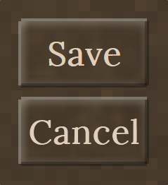
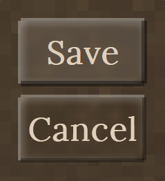
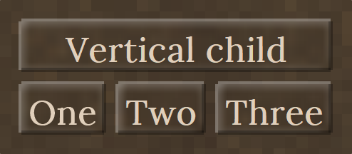
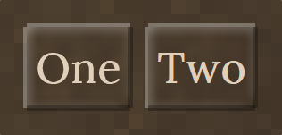
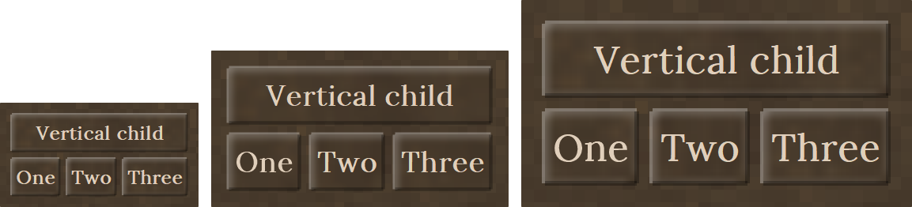

<h1>Hello there :)</h1>

This is an approach to fix the current GUI system for Vintage Story.
The core idea of this framework is a stack-container based way to structure and maintain a user
interface. For now I call it **Modern Vintage Story UI**, or **MVS_UI** for short.

<h2>Goals of this Project</h2>

* Make a more modder friendly approach to building user interfaces
  * Achieved by letting the developer only define the data he wants to show, and letting this API
    handle positioning, sizing and order
  * Control focused approach like in other .NET UI frameworks - WinForms, WPF, UWP and so on
* Dialog scaling and control positioning should work independently of GUI scale or window size
* <b>UI DESIGNER :D</b>
  * Not final, but the idea was to use the WPF designer with custom controls, so you can build
    Vintage Story user interfaces in XAML with a real visual designer
* Either JSON or XML exportable format
* Easy to implement custom controls
* Long term sustainability by decoupling this system from the vanilla one as far as possible, so
  game updates do not break all the user interfaces
* Long term thought: fixed positioning reintegrated, but compatible with the designer

The foundation is in place and holding, but there is still a good chunk of work to do. Right now
three controls exist (`RectangleControl`, `TextLabelControl`, `ButtonControl`); the layout, input
and scaling systems below them are meant to carry the rest.

<h2>What is included in here</h2>

* **Own parenting and positioning system**, not attached to `ElementBounds`
* **Autosizing** from content - containers from their children, text labels from their text and font
* **Repeatable layout.** Measure and arrange are separated: measuring reads only what the caller
  asked for, arranging writes only the layout result. Laying the same tree out twice gives the same
  answer, which is what makes reopening a dialog and editing it at runtime safe
* **Proper GUI scale support.** Everything you specify - `Margin`, `Padding`, `Size`, `FontSize`,
  `BorderWidth` - is in unscaled author units, exactly like `GuiElement.scaled()` in vanilla. The
  layout converts to device pixels. Changing the GUI scale slider updates open dialogs live
* **Real mouse capture.** The cursor is released while a dialog is open, clicks are consumed by the
  dialog instead of reaching the world, and block interaction is suppressed - see
  [Mouse handling](#mouse-handling)
* **Dynamic recomposing** after the UI was opened, so you can change and edit the UI as you like
  even if the dialog is already open
* **Decoupled rendering.** The control tree draws itself onto a single Cairo surface which is
  uploaded once per refresh; the vanilla GUI system is only used where it actually helps
  (`GuiStyle` colors, the dirt background pattern, `CairoFont` presets)
* **Easy way to implement new controls** - derive from `UIControl`, override `CalculateSize()` and
  `GenerateRenderData()`
* **A headless layout harness** that renders the UI to PNG and checks the layout invariants without
  starting the game - see [Layout harness](#layout-harness)

<h2>What is still ongoing</h2>

* Keyboard input and focus - there is no key handling at all yet, so no ESC to close and no text
  input. `api.Event.KeyDown` / `KeyUp` covers most of it; typed characters need a Harmony prefix on
  `ClientMain.OnKeyPress`
* `Orientation` (a control's own alignment) is currently inert - the constructor parameter named
  `_Orientation` sets `InsideOrientation` instead, and nothing assigns `Orientation`. See
  [Layout model](#layout-model)
* `Orientation.Fill` exists in the enum but is not implemented
* Redraw invalidation - every hover state change currently recomposes the whole surface
* Re-centering on window resize
* XAML editor or custom UI designer
* Cross compatibility with the vanilla UI (e.g. drag an item from a vanilla UI into a modern one)
* More styling options (custom backgrounds, fonts)
* New controls
  * Top bar / title bar (fixed or movable, matching the vanilla look)
  * Imagebox
  * Checkbox
  * Dropdown
  * Tabs
  * Color picker
  * Inventory grid (with auto scrollbar)
  * Itemslot
  * Context menu
  * Loading bar / progress bar
* Updates to existing controls
  * Imagebutton (or an updated button with an image source)
  * Panel and window should be auto-scrollbar capable (bool switch)
  * Edge drag resize window

<h1>Getting started</h1>

<h2>Setup</h2>

Declare MVS_UI as a dependency in your `modinfo.json`:

```json
"dependencies": {
    "game": "1.22.0",
    "modernvintagegui": "1.0.0"
}
```

And add it as a Reference to your Mod Project. 

Then just build dialogs from anywhere in your client code.

<h2 id="why-you-must-not-set-this-up-yourself">Why you must not set this up yourself</h2>

MVS_UI needs two things per client session, and its own `ModSystem` does both:

```csharp
// ModernVintageGUIModSystem.StartClientSide - this is the framework's job, not yours
harmony = new Harmony(HarmonyId);
harmony.PatchAll(typeof(ModernVintageGUIModSystem).Assembly);

uiManager = new UIManager(api);
```

**Harmony patches are process-wide.** Once `ClientMain.UpdateFreeMouse` is patched it is patched for
every caller in the game - there is no per-mod scope. So the single patch MVS_UI applies already
covers every mod that uses it.

If several mods each did this anyway, you would get one Harmony instance per mod registering the
same prefix on the same method, and one `UIManager` per mod all subscribed to the same mouse events
while `UIManager.Current` - a static - only ever points at the last one created. Nothing crashes
outright, but it is wasted work per frame and unpleasant to debug.

Bundling a copy of the assembly is worse. The game loads mod assemblies per path
(`Assembly.UnsafeLoadFrom`), so two copies mean two sets of types with the same names:
`UIControl` from copy A is not the same type as `UIControl` from copy B, each copy has its own
static `UIManager.Current`, its own patch and its own dialog registry. Depend on the mod, do not
ship the DLL.

<h2>Create a simple dialog from anywhere in your code</h2>

```csharp
var dialog = new CustomDialogElement(capi, "MyTestDialog", "My Title");

var text = new TextLabelControl("Hi im Fancy!");
dialog.Children.Add(text);

dialog.Show();
```

<h2>Result</h2>


<h2>Buttons</h2>

`ButtonControl` sizes itself to its caption, draws the vanilla-style embossed border and raises the
usual mouse events.

```csharp
var dialog = new CustomDialogElement(capi, "ButtonDemo", "Buttons");

var save = new ButtonControl(_Name: "saveButton");
save.Text = "Save";
save.Clicked += (sender, e) => capi.ShowChatMessage("Save clicked");
dialog.Children.Add(save);

var cancel = new ButtonControl(_Name: "cancelButton");
cancel.Text = "Cancel";
cancel.Clicked += (sender, e) => dialog.Hide();
dialog.Children.Add(cancel);

dialog.Show();
```

<h2>Result</h2>



With the cursor over the first button:



<h2>Stacking horizontally</h2>

A container stacks its children along `InsideOrientation`. `Orientation.Top` (the default) stacks
vertically, `Orientation.Left` stacks horizontally.

```csharp
var dialog = new CustomDialogElement(capi, "StackDemo", "Stacking");

// Vertical by default
var header = new ButtonControl(_Name: "header");
header.Text = "Vertical child";
dialog.Children.Add(header);

// A row of buttons
var row = new RectangleControl();
row.InsideOrientation = Orientation.Left;

foreach (string caption in new[] { "One", "Two", "Three" })
{
    var button = new ButtonControl();
    button.Text = caption;
    row.Children.Add(button);
}

dialog.Children.Add(row);
dialog.Show();
```

<h2>Result</h2>



<h2>Mixing controls in one row</h2>

```csharp
var row = new RectangleControl();
row.InsideOrientation = Orientation.Left;

var left = new ButtonControl();
left.Text = "Test";
row.Children.Add(left);

var label = new TextLabelControl("in between");
label.Orientation = TextOrientation.Center;
row.Children.Add(label);

var right = new ButtonControl();
right.Text = "Test";
row.Children.Add(right);
```

<h2>Result</h2>


<h2>Editing the UI after it was opened</h2>

Adding or removing a child triggers a full relayout and redraw of the dialog it belongs to. You do
not have to close and reopen anything. Property changes on a control are not observed yet, so ask
for a redraw yourself after those.

```csharp
dialog.Show();

// Later, from anywhere
row.Children.Add(new ButtonControl { Text = "Added at runtime" });

myLabel.Text = "Hey don't touch my fancy Text!";
dialog.Refresh();   // text changes are not observed yet, so ask for a redraw
```

<h2>Result</h2>

Before:



After adding a third button at runtime - the dialog resized itself around it:


<h1>How it works</h1>

<h2 id="layout-model">Layout model</h2>

Layout runs in two passes, and the split is what keeps it repeatable:

| | written by | read by |
|---|---|---|
| `ExplicitSize` | you, through the `Size` setter | measure, when `IsAutoSize` is false |
| `CalculatedSize` | `CalculateSize()` (measure) | the overflow / clipping check |
| `Size` | measure and arrange, through `SetLayoutSize()` | rendering and hit testing |

**If you write a control, keep to that split**: measure must read `ExplicitSize`, never `Size`, and
arrange must write through `SetLayoutSize()`, never through the `Size` setter. Writing a measured
value through the `Size` setter turns it into an explicit size, and the control then stops measuring
itself on the next pass - which shows up as boxes that keep an old size while their content is drawn
at the current one.

Sizes and positions on a laid out tree are in **device pixels**. Everything you assign - `Margin`,
`Padding`, `Size`, `FontSize`, `BorderWidth` - is in **unscaled author units** and is multiplied by
`LayoutScale` during layout, the same way `GuiElement.scaled()` works in the vanilla GUI. Children
are laid out in dialog-local space with the root at 0/0; only the dialog itself is then moved to its
position on screen.

A known rough edge: the constructor parameter called `_Orientation` sets **`InsideOrientation`** -
the direction a control stacks its *children* in. The `Orientation` property, meant to be a
control's own alignment inside its parent, is currently never assigned and has no effect. Set
`InsideOrientation` explicitly when you want to be sure what you get.

<h2 id="mouse-handling">Mouse handling</h2>

Two things are needed to make a non-`GuiDialog` UI usable, and neither has an API hook.

`ClientMain.UpdateFreeMouse()` recomputes `MouseGrabbed` once per rendered frame purely from the
number of open **vanilla** `GuiDialog`s. A custom dialog does not count, so the game re-grabs the
cursor on the next frame. `ClientMainUpdateFreeMousePatch` is a Harmony **prefix** that replaces the
method while one of our dialogs is open. It has to replace rather than correct it: both `MouseGrabbed`
setters have side effects on every change of value - the platform warps the cursor to the window
center, and `ClientMain` drops the item held on the mouse - so flipping the value back in a postfix
would fire those twice per frame.

Input goes through `api.Event.MouseDown` / `MouseUp` / `MouseMove` / `MouseWheelMove`, not through
`ClientPlatformWindows.mouseEventHandlers`. The platform hands every entry in that list its own
freshly allocated `MouseEvent`, so setting `Handled` there cannot stop the game from also processing
the click. `ClientMain` triggers the event API *before* forwarding to its client systems and aborts
as soon as `Handled` is set, so that is the only hook that can actually swallow input.

`UIManager` routes events to the open dialogs topmost first, and steps aside when the cursor is over
an open vanilla dialog so the inventory and the escape menu stay usable.

<h2>Events</h2>

Every `UIControl` exposes `Clicked`, `Enter`, `Exit`, `MouseDown`, `MouseUp`, `MouseMove` and
`MouseWheel`. A click is only raised when press and release happened on the same control.

```csharp
button.Enter   += (s, e) => { /* hover in  */ };
button.Exit    += (s, e) => { /* hover out */ };
button.Clicked += (s, e) => { /* e.X, e.Y, e.Button */ };
```

<h2>Writing a custom control</h2>

```csharp
public class MyControl : UIControl
{
    public override PointD CalculateSize()
    {
        // Measure: return the desired size in device pixels, and record it.
        PointD measured = new PointD(ScaledPadding * 2 + 100, ScaledPadding * 2 + 20);

        CalculatedSize = measured;
        SetLayoutSize(measured);
        return measured;
    }

    public override void GenerateRenderData(ImageSurface surface, Context ctx)
    {
        // Draw into the shared surface using Position and Size (already device pixels).
        ctx.Rectangle(Position.X, Position.Y, Size.X, Size.Y);
        ctx.Fill();

        base.GenerateRenderData(surface, ctx);   // draws the children
    }
}
```

Do not upload anything to the GPU in `GenerateRenderData` - the dialog uploads the finished surface
exactly once per refresh.

<h2 id="layout-harness">Layout harness</h2>

`ZLayoutHarness` runs the real layout code without the game, renders each scenario to PNG and checks
the invariants:

```
dotnet run --project ModernVintageGUI/ZLayoutHarness
```

It exits 0 when everything passes and 1 otherwise, so it works in CI. For every scenario it checks:

* **Idempotence** - five layout passes in a row must not move anything
* **No collapsed controls** - nothing may end up with zero width or height
* **No overlapping siblings** in a stacking container
* **Proportional scaling** - laying out at 1.5x and 2x must give the same design, that much larger
* **Surviving a scale change** - a tree laid out over `1x -> 1.5x -> 2x -> 1.5x -> 1x` must match a
  freshly built tree at each scale, which is what happens in game when a dialog is reopened after
  the GUI scale slider moved

Add a scenario in `Scenarios.cs` whenever you add a control. What the harness cannot cover is
anything that only exists at runtime in the game: the Harmony patches, the actual mouse grab, GPU
uploads and the interplay with vanilla dialogs.

Every picture in this README is rendered by the same harness, through the real layout and drawing
code, so they can be regenerated instead of re-screenshotted whenever a control changes:

```
dotnet run --project ModernVintageGUI/ZLayoutHarness -- --docs docs/images
```

The same tree laid out at 1x, 1.5x and 2x - one design, three scales:



<h1>Building</h1>

Set the `VINTAGE_STORY` environment variable to your game installation directory, then:

```
dotnet build ModernVintageGUI.sln
```

The mod project builds into `ModernVintageGUI/ModernVintageGUI/bin/<config>/Mods/mod`. If the game
is running with that folder on its mod path it locks the output DLL - close the client before
rebuilding, or build the other configuration.
