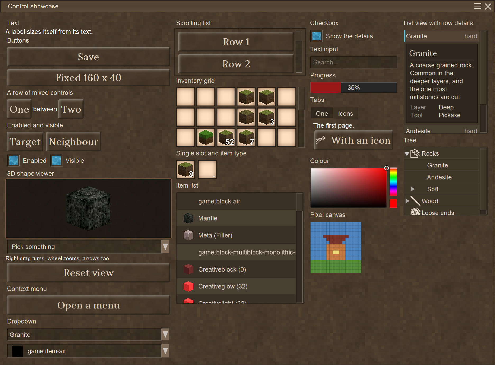
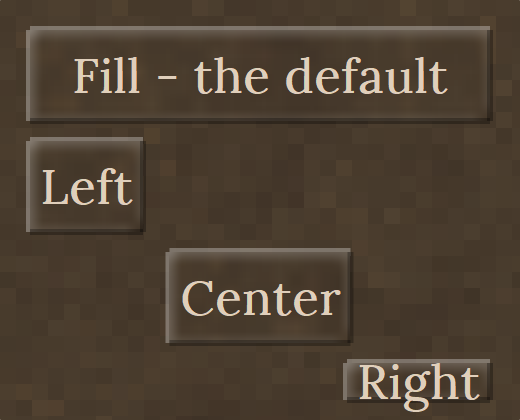
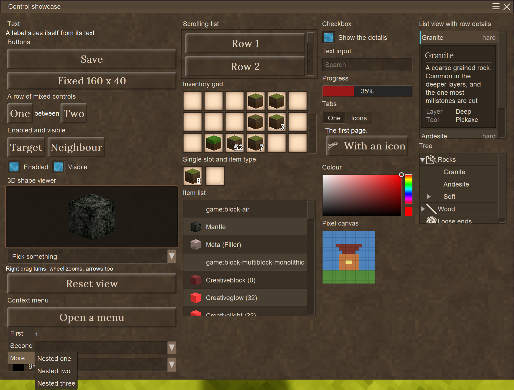
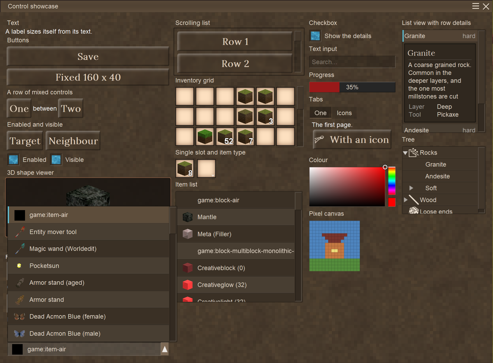
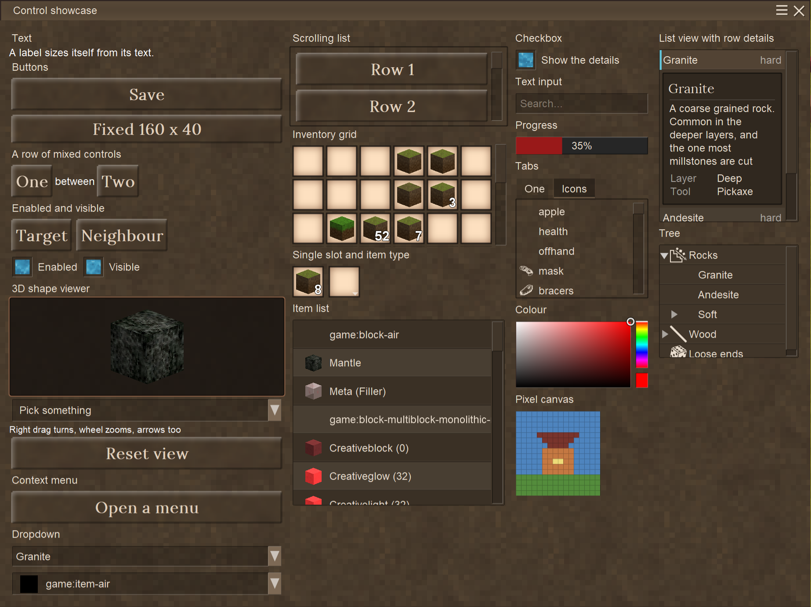
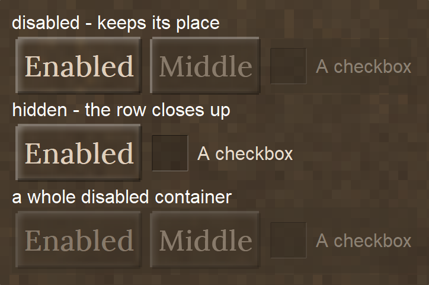

<h1>Hello there :)</h1>

This is an approach to fix the current GUI system for Vintage Story.
The core idea of this framework is a stack-container based way to structure and maintain a user
interface. For now I call it **Modern Vintage Story UI**, or **MVS_UI** for short.



*Every control in one dialog, photographed in the game. The
[screenshot pipeline](ModernVintageGUI/ZIngameShots/README.md) opens the same dialog the test hotkey
opens and takes the picture, so it cannot show a screen that no longer exists.*

> **Full documentation:** the [wiki](https://github.com/DrakenRolle/ModernVintageGUI/wiki) - every
> control in detail, the layout rules, GUI scale, events, focus and depth, and how to write your
> own control.

<h2>Goals of this Project</h2>

* Make a more modder friendly approach to building user interfaces
  * Achieved by letting the developer only define the data he wants to show, and letting this API
    handle positioning, sizing and order
  * Control focused approach like in other .NET UI frameworks - WinForms, WPF, UWP and so on
* Dialog scaling and control positioning should work independently of GUI scale or window size
* <b>UI DESIGNER :D</b>
  * Not final, but the idea was to use the WPF designer with custom controls, so you can build
    Vintage Story user interfaces in XAML with a real visual designer
* Either JSON or XML exportable format
* Easy to implement custom controls
* Long term sustainability by decoupling this system from the vanilla one as far as possible, so
  game updates do not break all the user interfaces
* Long term thought: fixed positioning reintegrated, but compatible with the designer

<h2>What is included in here</h2>

* **Own parenting and positioning system**, not attached to `ElementBounds`
* **Autosizing** from content - containers from their children, text labels from their text and font
* **Repeatable layout.** Measure and arrange are separated, so laying the same tree out twice gives
  the same answer. That is what makes reopening a dialog and editing it at runtime safe
* **Proper GUI scale support.** Everything you specify is in unscaled author units, exactly like
  `GuiElement.scaled()` in vanilla. Moving the GUI scale slider updates open dialogs live
* **Real mouse capture.** The cursor is released while a dialog is open, clicks are consumed by the
  dialog instead of reaching the world, and block interaction is suppressed
* **Focus driven z-order.** A focused dialog draws above the vanilla GUI and takes clicks in the
  overlap; an unfocused one goes back below it - the same rule the game applies to its own windows
* **Keyboard focus.** Tab and the arrow keys walk the interactive controls in reading order, Enter
  and Space activate the focused one, Escape closes the dialog. Only the keys that actually did
  something are consumed, so the game stays playable with a dialog open
* **Dynamic recomposing** after the UI was opened, so you can change and edit the UI as you like
  even if the dialog is already open
* **Decoupled rendering.** The control tree draws itself onto a single Cairo surface which is
  uploaded once per refresh; the vanilla GUI system is only used where it actually helps
* **A headless layout harness** that renders the UI to PNG and checks the layout invariants without
  starting the game

* **Clipping and scrolling.** A container can cut what its children draw at its own edge, and any
  container can grow a vanilla styled scrollbar on either axis - the bars hang on the container
  rather than being controls of their own
* **Real inventories.** An inventory grid is a view of an actual inventory the server knows about,
  so items move between it and the player's bag, a chest or the creative inventory exactly as they
  move between two vanilla grids - including the item tooltip and shift click
* **Inventory events** that report what changed and what was there before, whoever changed it - a
  click in the grid, a shift click from elsewhere, a hopper, another player, or the server
* **Text input** with the keyboard layout applied, so umlauts, accents and dead keys work. The
  game offers typed characters to nothing but its own dialogs, so this takes a Harmony patch of
  its own
* **Two drawing passes.** The control tree goes onto one Cairo surface, and anything that cannot -
  an item stack, drawn from the item atlas with its own shader - is drawn on top per frame, the
  same split the vanilla GUI makes

* **One kind of list row.** A dropdown entry, a list view row and a tree node are the same control
  underneath (`ListRowControl`), so the banding, the hover, the icon column and the item tooltip
  are decided once rather than three times - and a list, a tree and a menu read as one family

* **Alignment across the stack.** A container decides which way it stacks; each control decides
  where it sits across that - stretched, at either end, or centred. Along the stacking direction
  there is nothing to decide, so a value naming that axis is read as "stretch" rather than as a
  contradiction
* **Hiding and disabling** on every control, and they are different on purpose: hiding collapses
  and closes the gap, disabling keeps the place and washes the control out. Both inherit downwards
  without touching what the children asked for, both take the control out of the tab order and out
  of the mouse's reach, and both take the keyboard focus with them if it was there
* **Layout properties invalidate themselves.** Assigning `Size`, `Margin`, `Padding`, `MaxSize`,
  `Orientation`, `ClipsChildren` or `IsVisible` on an open dialog re-runs the layout and redraws it;
  `IsEnabled` redraws. Which properties do that is a list rather than "everything that notifies",
  because the arrange pass writes `Position` and a rule that invalidated on any change would make
  the layout re-enter itself forever - the harness checks that a layout pass writes none of them
* **Split panels.** A box cut into any number of panels with a grab bar between each pair; the
  player drags a bar to resize its two neighbours. `InsideOrientation` decides whether the bars run
  vertically (panels side by side) or horizontally (panels stacked), and the shares are kept as
  fractions so they survive the GUI scale slider
* **A short syntax.** `UI.Column(UI.Heading("Save"), UI.Row(UI.Button("Yes", Save), UI.Button("No")))`
  builds the tree it reads like, `parent.Add(child)` hands the child back, and `.Aligned(...)`,
  `.Enabled(...)` and friends chain. Plain values - a name, a size, a margin - are properties.
  Optional - the constructors and object initializers still work
* **Five sample windows** of rising complexity, from a confirm box to a dashboard of nested split
  panels, on the K hotkey - test UIs for the framework and worked examples for a mod

**Controls so far:** `RectangleControl`, `TextLabelControl`, `ButtonControl`, `ContextMenuControl`,
`TitleBarControl`, `ItemSlotControl`, `InventoryGridControl`, `DropdownControl`,
`ItemTypeSelectorControl`, `CheckboxControl`, `TextInputControl`, `ProgressBarControl`,
`TabsControl`, `ImageControl`, `ColorPickerControl`, `PixelCanvasControl`, `ListViewControl`,
`ItemListViewControl`, `DetailViewControl`, `TreeViewControl`, `ShapeViewerControl`, and
`SplitPanelControl`.

<h2>What is still ongoing</h2>

* Redraw invalidation - every hover state change still redraws the whole surface. On the showcase
  that is ~9 ms at GUI scale 1 and ~19 ms at scale 2: 3.8 ms of it the 67 text labels and 2.1 ms
  the emboss blur behind the 14 buttons. The way out is the one vanilla takes and `ItemSlotControl`
  already takes here: compose an element once into a surface of its own and blit it. Measure before
  you guess - see `--profile`
* No serialisation. The JSON or XML export in the goals above does not exist yet, and neither does
  the runtime loader a designer file would need
* Re-centering on window resize
* XAML editor or custom UI designer
* More styling options (custom backgrounds, fonts) - font name and size are decided per control
  today, with no theme to change them in one place
* Edge drag resize window
* No `MinSize`, no gap between a container's children other than each child's own margin, and no
  grid layout - stacking and overlay are the only two

<h1>Getting started</h1>

<h2>Setup</h2>

Declare MVS_UI as a dependency in your `modinfo.json`:

```json
"dependencies": {
    "game": "1.22.0",
    "modernvintagegui": "1.0.0"
}
```

And add it as a Reference to your Mod Project.

That is all - MVS_UI initialises itself. **Do not** apply its Harmony patches or create a
`UIManager` in your own mod, and **do not** bundle a copy of the assembly; see
[why](https://github.com/DrakenRolle/ModernVintageGUI/wiki/Input-Focus-and-Rendering).

<h2>A dialog</h2>

```csharp
var dialog = new CustomDialogElement(capi, "MyTestDialog", "My Title");

var text = new TextLabelControl("Hi im Fancy!");
dialog.Children.Add(text);

dialog.Show();
```


<h2>Buttons</h2>

```csharp
var save = new ButtonControl(_Name: "saveButton");
save.Text = "Save";
save.Clicked += (sender, e) => capi.ShowChatMessage("Save clicked");
dialog.Children.Add(save);
```


<h2>Stacking</h2>

A container stacks its children along `InsideOrientation` - `Top` (the default) downwards, `Left`
sideways.

```csharp
var row = new RectangleControl();
row.InsideOrientation = Orientation.Left;

foreach (string caption in new[] { "One", "Two", "Three" })
{
    var button = new ButtonControl();
    button.Text = caption;
    row.Children.Add(button);
}

dialog.Children.Add(row);
```


Controls of different kinds mix freely in one row:


<h3>Across the stack</h3>

`InsideOrientation` says which way a container stacks. A control's own `Orientation` says where it
sits *across* that direction - so in a column it is horizontal, and in a row it is vertical:

```csharp
column.Children.Add(new ButtonControl { Text = "Fill - the default" });
column.Children.Add(new ButtonControl { Text = "Left",   Orientation = Orientation.Left });
column.Children.Add(new ButtonControl { Text = "Center", Orientation = Orientation.Center });
column.Children.Add(new ButtonControl { Text = "Right",  Orientation = Orientation.Right });
```



`Fill` is the default and stretches the control across the container, which is what everything did
before there was a choice. The other three leave it at its natural size and pick an end - and
`Right` puts its trailing edge exactly where the stretched one ends, so a right aligned button under
a stretched row lines up rather than nearly lines up.

Along the stacking direction this says nothing, because the order of the children already decides
that. `Top` in a column and `Left` in a row therefore read as `Fill` rather than as a contradiction,
and so does anything in an overlay container, which stacks in no direction at all.

> Note for `TextLabelControl`: where the *text* sits inside the label is `TextAlign`. It used to be
> called `Orientation` too, which hid the one above and made a label the one control that could not
> be aligned in its container.

<h2>The short way</h2>

Everything above can also be written as the tree it is. `UI` builds controls with the dialog's font
and colour already set, and the helpers hand the control back so a line can configure it and add it
at once:

```csharp
dialog.Add(UI.Column(
    UI.Title("Discard the changes?"),
    UI.Paragraph("The recipe was edited and not saved. Closing now throws the edits away.", 320),
    UI.Row(
            UI.Button("Keep editing", () => dialog.Hide()),
            UI.Button("Discard", Discard, GuiIcons.Eraser))
        .Aligned(Orientation.Right)));

var save = column.Add(UI.Button("Save", Save));   // Add returns the child
save.Size = new PointD(160, 40);
save.IsAutoSize = false;
```

`UI.Column`, `UI.Row`, `UI.Overlay`, `UI.Panel`, `UI.Group`, `UI.Scroll`, `UI.Split` and `UI.Tabs`
are the containers; `UI.Label`, `UI.Heading`, `UI.Title`, `UI.Paragraph`, `UI.Button`, `UI.Checkbox`,
`UI.TextBox`, `UI.Dropdown`, `UI.Progress`, `UI.Icon` and `UI.Spacer` the controls. On any control:
`.Aligned`, `.Enabled`, `.Visible`, `.Clipping`, `.AutoSized` and `.OnClick`. Plain values - `Name`,
`Size` with `IsAutoSize = false`, `Margin`, `Padding`, `MaxSize` - are assigned to the property, exactly
as on a control made with `new`; there is deliberately no `.WithSize(...)` or `.WithName(...)`. All of
it is optional and returns the concrete control. The sample windows under `Samples/` are written this
way throughout; [docs/syntax-review.md](docs/syntax-review.md) has the reasoning and the things that
were left as they are.

<h2>Keyboard</h2>

Tab and the arrow keys move the focus, Enter and Space activate, Escape closes. Controls the
player operates are in the tab order; decoration is not.

```csharp
var button = new ButtonControl { Text = "Save" };   // focusable already
myPanel.IsFocusable = false;                        // and containers are not

dialog.CloseOnEscape = false;                       // for a dialog that must be dismissed on purpose
```


Hover and focus are separate states, so a control can be in both. Nothing is focused when a dialog
opens, which means Enter and Space stay with the game until the player tabs into the dialog or
clicks a control.

A text field takes every key while it is focused, so typing does not trigger the game's hotkeys -
Escape still leaves, because a dialog you cannot escape from is a trap:

```csharp
var search = new TextInputControl { PlaceholderText = "Search...", MaxLength = 40 };
search.TextChanged  += (s, text) => Filter(text);
search.EnterPressed += (s, text) => Submit(text);
```

It edits the way a text field anywhere else does. The caret goes where the mouse clicks; a drag,
a double click or Shift with the arrow keys, Home and End selects; Ctrl with the arrows jumps a
word; Ctrl+A takes everything; Ctrl+X, Ctrl+C and Ctrl+V go through the game's clipboard, and a
`CharacterFilter` applies to a paste as it does to typing. Text longer than the box scrolls
sideways so the caret stays in view, and neither it nor the placeholder is ever drawn outside the
frame. `CaretPosition`, `SelectionStart`, `SelectionLength` and `SelectedText` say where things
are; `Select`, `SelectAll`, `InsertText`, `Cut`, `Copy` and `Paste` do from code what the keys do.

The caret blinks without redrawing the dialog: the surface holds the text, and the caret is a two
pixel texture the per frame pass draws over it on the frames it is on. `CaretBlinks = false` draws
it solid into the surface instead, which is also what happens wherever there is no per frame pass -
the layout harness and the documentation pictures.

<h2>Context menus</h2>

A menu hangs on any control, positions itself at an anchor and supports cascades. One subscription
sees picks from every level.

```csharp
var menu = new ContextMenuControl(button, items, "positionMode", ContextMenuAnchor.BottomLeft);
button.Clicked += (sender, e) => menu.Toggle();

menu.ItemActivated += (sender, e) => capi.ShowChatMessage(string.Join(" > ", e.Path.Select(i => i.Text)));
```



<h2>Inventories</h2>

An inventory grid shows a real inventory. Not a copy and not a client side stand-in: the server
knows about it, so the player moves items in and out of it the same way they would with a chest,
shift click and creative inventory included, and what they leave in it is still there next time.

Create the inventory with a size and say where it belongs. That decides everything else:

```csharp
// A block: one inventory per block, saved with the chunk, drops when the block breaks
public class BlockEntityMyCrate : ModInventoryBlockEntity
{
    public BlockEntityMyCrate() : base(size: 16, inventoryClassName: "mycrate") { }
}

grid.SetInventory(ModInventoryAccess.ForBlock(capi, pos, blockEntity.Inventory));
```

```csharp
// Shared: any number of blocks or dialogs open the same one and see each other's changes
sapi: inventorySystem.RegisterSharedInventory("guildbank", 32);
capi: grid.SetInventory(ModInventoryAccess.ForShared(capi, "guildbank", 32));

// Per player: a personal stash, saved with that player
sapi: inventorySystem.RegisterPlayerInventory("loadout", 24);
capi: grid.SetInventory(ModInventoryAccess.ForPlayer(capi, "loadout", 24));
```

One argument - the access carries the packets a slot move produces and opens and closes the
inventory along with the dialog. Or let the grid bring its own:

```csharp
var grid = new InventoryGridControl(6, "loadout", internalInventory: true, slotCount: 24);
var slot = InventoryGridControl.SingleSlot("output");   // the 1x1 case
```

The server still has to declare that one, because it decides what exists and how big it is:

```csharp
inventorySystem.RegisterPlayerInventory(
    InventoryGridControl.InternalInventoryName("myDialog", "loadout"), 24);
```

Create the server half once, in `StartServerSide`:

```csharp
inventorySystem = new ModInventorySystem(sapi);
```

<h3>Knowing what changed</h3>

```csharp
grid.ItemPutIn    += (s, e) => Log($"{e.After.StackSize}x {e.After.GetName()} into slot {e.SlotId}");
grid.ItemTakenOut += (s, e) => Log($"{e.Before.GetName()} left slot {e.SlotId}");
grid.SlotChanged  += (s, e) => Log($"{e.Change}, {e.CountDelta:+#;-#;0}");
```

These fire for every change, not only for clicks in your grid: a shift click from the player's
bag, a hopper, another player in a shared inventory and the server correcting the client all end
up here. `Before` is a copy taken before the change, because by the time anyone hears about a move
the old stack is gone. `InventoryWatcher` does the same for an inventory without a GUI, on either
side.

<h2>Dropdowns and item pickers</h2>

```csharp
var dropdown = new DropdownControl { PlaceholderText = "Pick a rock", MaxVisibleItems = 8 };

dropdown.SetItems(new[] {
    new DropdownItem("Granite", value: "granite"),
    new DropdownItem(new ItemStack(flint), value: "flint"),   // icon and item tooltip
});

dropdown.SelectionChanged += (s, e) => capi.ShowChatMessage(e.Value?.ToString());
```

A list built from item stacks draws itself like the handbook's Blocks and Items page and brings
the game's item tooltip with it. `MaxVisibleItems` and `MaxListHeight` decide when it starts
scrolling - both unlimited by default, and the list is always cut down to what fits on screen.



The rows are banded and separated by a hairline, and the picked one keeps a bar on its leading
edge - so "where the cursor is" and "what is picked" stay two different things to look at while
the list scrolls past. `RowStriping = false` turns the banding off for a list of two or three
rows, where it is a pattern without a job. The closed box lifts under the cursor and its arrow
turns over while the list is open.

For picking an item *type* rather than holding an item there is a control that looks like a slot
and opens the same list:

```csharp
selector.SetTypes(types);                                   // the list comes from you
selector.SelectedItemType;                                  // ItemStack?
selector.SelectedCode;                                      // AssetLocation?
ItemTypeSelectorControl.CollectVariants(capi, code);        // every variant of one thing
```

<h2>Lists, details and trees</h2>

A dropdown's list exists only while it is open. A list view stands on the dialog and is the thing
the player works in - it scrolls, it keeps one row picked, and clicking a row folds its details
out *under that row*, the way a DataGrid shows row details:

```csharp
var list = new ListViewControl { Size = new PointD(200, 150), IsAutoSize = false };

list.SetItems(new[] {
    new ListViewItem("Granite", value: "granite") {
        Secondary   = "hard",                           // the right hand column
        Description = "A coarse grained rock.",         // the paragraph in the panel
        Details     = { new DetailEntry("Layer", "Deep") }
    },
    new ListViewItem("Chalk", value: "chalk") { Secondary = "soft" }
});

list.SelectionChanged += (s, e) => capi.ShowChatMessage(e.Value?.ToString());
```


The panel is an ordinary child of the list sitting between two rows, so it pushes what is below
it down, scrolls with the rows and is clipped at the same edge - nothing floats over anything.
Clicking another row moves it there, clicking the open row again folds it back in
(`ToggleDetailsOnReclick = false` keeps the DataGrid's own rule, where the details only ever
change rows and never close).

`DetailView` is the panel itself, and `DetailMode` decides where it goes:

* `Inline` - the default, shown above: inside the list, under the picked row
* `Attached` - you place `list.DetailView` in your own tree instead, beside the list or on
  another tab, and the list only fills it. For a master-detail screen where the panel stands
  still while the list is browsed
* `None` - nothing folds out. `SelectionChanged` and `ItemActivated` still fire

```csharp
list.ShowDetails(list.Items[0]);   // fold a row out from code
list.CloseDetails();               // and back in
list.AreDetailsOpen;               // whether anything is folded out
```

`ItemListViewControl` is the same list for item stacks: handbook row style, the game's item
tooltip on every row, and details that describe the picked item with the game's own words rather
than with text you typed a second time.

```csharp
var items = new ItemListViewControl { Size = new PointD(230, 280), IsAutoSize = false };
items.SetStacks(stacks);            // or SetCollectibles(...)
items.SelectedStack;                // ItemStack?
items.SelectedCode;                 // AssetLocation?
```

Opening a row also folds out **every variant of that block, as a list of its own** - one row for
rock, and inside it the granite, the andesite and the chalk, each with the game's icon and
tooltip. It is the same control nested one level deep, and that is also where it stops: the nested
list has `ShowVariants = false`, so a variant opens its description rather than a third list.
`VariantSelected` reports a pick from the inner list, while `SelectionChanged` stays on the kind
that was opened.

Any row can carry a control for its details, which is all the variant list is:

```csharp
row.DetailContent = myOwnPanel;     // shown under the facts while this row is open
```

A tree is a list whose rows fold out. The nodes are data, not controls - the rows are made from
whatever is visible right now, so a tree of ten thousand nodes with three of them open costs three
rows:

```csharp
var tree = new TreeViewControl { Size = new PointD(200, 190), IsAutoSize = false };

TreeNode rocks = tree.AddNode("Rocks");
rocks.Add("Granite", value: "rock-granite");
rocks.Add("Chalk",   value: "rock-chalk");
rocks.Expand();

tree.SelectionChanged += (s, e) => capi.ShowChatMessage(e.Node?.Text);
```


Clicking the triangle folds a branch, clicking anywhere else picks the node. From the keyboard,
Right folds out, Left folds in and then walks to the parent, and Up and Down are the dialog's own
focus movement - which in a tree is exactly the visible rows in exactly the right order.

All three scroll the way every container here does, by implementing `IScrollable`: a wheel tick,
a drag on the vanilla scrollbar, and clipping at the viewport edge.

<h2>Split panels</h2>

`SplitPanelControl` cuts a box into panels with a grab bar between each pair. The player drags a bar
to give one panel room at the cost of its neighbour; the other panels stay where they are.

```csharp
var split = new SplitPanelControl(panelCount: 3, Orientation.Left)   // side by side, vertical bars
{
    Size = new PointD(420, 240)
};

split.Panels[0].Children.Add(tree);
split.Panels[1].Children.Add(list);
split.Panels[2].Children.Add(details);
split.SetFractions(0.25, 0.45, 0.30);        // shares of the width; 1, 2, 1 works too

split.SplitterMoved += (s, e) => capi.ShowChatMessage("bar " + e.SplitterIndex + " moved");
```

Or, with the short syntax, one panel per argument: `UI.Split(Orientation.Top, upper, lower)`.

`InsideOrientation` decides where the bars sit, the same way it decides the stacking direction of
any container - because that is what it is here too: `Left` or `Right` puts the panels side by side
with vertical bars, `Top` or `Bottom` stacks them with horizontal bars. Give the split panel a size:
its panels are shares of a whole, and a whole that grew to fit its content would leave nothing to
share out. The shares are fractions rather than pixels, so they survive the GUI scale slider.

The panels are ordinary `RectangleControl`s that clip, so content larger than its panel is cut at
the bar rather than squashed. A hidden panel (`split.Panels[1].IsVisible = false`) takes its bar with
it and hands its room to the others; showing it again gives it back. `MinPanelSize` (24 by default)
is how small a drag can make a panel, `SplitterThickness` how wide the bar is, `IsResizable = false`
locks the bars, and `AddPanel()` / `RemovePanel(i)` change the count at runtime. From the keyboard a
focused bar moves with the arrow keys along its axis; `MoveSplitter(i, pixels)` and
`SetSplitterPosition(i, 0.3)` do the same from code. Split panels nest: the explorer and the
dashboard samples put a three way split inside a stacked one.

<h2>Anything in 3D</h2>

`ShapeViewerControl` shows a block, an item, a multiblock structure, an entity or any shape as a
model you can turn with the right mouse button and zoom with the wheel — the viewer the character
creator has, as a control:

```csharp
var viewer = new ShapeViewerControl { Size = new PointD(150, 150), IsAutoSize = false };

viewer.ShowBlock(capi.World.GetBlock(new AssetLocation("game:crate-normal-oak")));
viewer.ShowItem(item);                                   // a flat icon becomes the game's voxel slab
viewer.ShowStack(stack);                                 // whatever a stack holds

viewer.ShowBlocks(new[] {                                // a multiblock: blocks at offsets
    (new Vec3i(0, 0, 0), casing), (new Vec3i(1, 0, 0), casing),
    (new Vec3i(0, 0, 1), casing), (new Vec3i(1, 0, 1), casing) });
viewer.ShowBlocks(memberPositions, capi.World.BlockAccessor);   // the blocks standing at positions
viewer.ShowSchematic(schematic, capi.World);            // or a schematic

viewer.ShowEntity(capi.World.GetEntityType(new AssetLocation("game:wolf-male")));  // a type, as a still
viewer.ShowEntity(capi.World.Player.Entity);            // a live entity: animated, dressed

viewer.ShowShape(shape, capi.Tesselator.GetTextureSource(block));   // any shape, any textures
viewer.ShowShape(new AssetLocation("game:block/wood/crate"), textures);
viewer.ShowMesh(meshData);                               // or a mesh you built yourself
viewer.ResetView();                                      // back to the starting angle and zoom
```

Right drag turns it, the wheel zooms, and with the viewer focused the arrow keys turn it too. Pitch
stops at the poles so the model cannot be rolled upside down, yaw goes round and round. A zoomed in
model is clipped at the frame.

Whatever is shown is fitted by its bounding sphere, so a pebble, a pulverizer and a three block
tall creature come out the same apparent size, and a bigger frame simply shows a bigger model. A
block whose shape is larger than its cube — most multiblock controllers — is fitted whole.

Turning and zooming cost **no redraw**. They change three floats that the per frame pass reads, so a
drag does not rebuild the dialog surface — which is the most expensive thing this framework does.

The mesh is built once, on the first frame that has a client API to build it with, and released when
the dialog is disposed. Building a tree before there is a dialog therefore works, and so does the
layout harness, which has no API at all and lays the viewer out like any other control. A live
entity is the one thing that is not a mesh: it goes through the game's own entity renderer every
frame, exactly as the character creator draws the player.

```csharp
viewer.ModelFill = 0.9;                            // how much of the frame the model fills at zoom 1
viewer.UnscaledModelSize = 72;                     // or a fixed size, in author units
viewer.DefaultYaw = 45; viewer.DefaultPitch = 22.5; // where ResetView puts it
viewer.RotateButton = EnumMouseButton.Right;       // the default
viewer.WheelZooms = false;                         // let a scrolling list have the wheel instead
viewer.LiveEntityRendering = false;                // draw entities as stills too
viewer.DrawsFrame = false;                         // no recessed panel of its own
```

<h3>How it draws, and what is still to be looked at</h3>

The model is drawn with the game's own `gui` shader, the one already bound when the interactive pass
runs and the one `RenderItemstackToGui` draws a block in a slot with. The stage arrives with the depth
test, the depth mask and back face culling on, which is exactly what a turning model needs, so no GL
state is touched at all. An earlier version swapped in the world shader and toggled the depth state
around its draw; both of those were where its bugs came from — a white sky over a grass field, from a
depth mask switched off for the whole engine.

Two things fall out of the way the stage works and are worth knowing before touching the render pass:

* **A half turn, not a mirror.** The model's Y axis points up and the GUI's points down. They are
  reconciled with a 180° turn about X rather than a Y mirror, because culling is on and a mirror
  reverses the winding of every face — the model would be drawn inside out.
* **Depth is squashed to a band.** The ortho stage tests depth and a larger z is nearer. A model has
  depth of its own, so it is placed a little in front of the dialog surface and squashed along z
  whenever it would reach outside `ModelDepthBand`. The projection is orthographic, so the eye sees
  nothing of that — and a large, zoomed in model stays behind the stack on the cursor.

What has not yet happened is a look at it in a running client: the render pass is written against
the decompiled engine code, and the two places to check first are that the model lands at the right
depth and size, and that a live entity stands centred in its frame.

<h2>Icons</h2>

Any control that takes an `IconName` takes the game's icons and yours alike. Register an SVG once
and use it by name:

```csharp
GuiIcons.Register(capi, "gear", new AssetLocation("mymod:textures/icons/gear.svg"));

var button = new ButtonControl { Text = "Settings", IconName = "gear" };
```

`GuiIcons.Available(capi)` lists everything that will draw - the game's own, discovered from the
running game rather than from a list written down here, plus anything registered. The showcase has
a gallery of them under the "Icons" tab, because a name does not tell you what an icon looks like.



<h2>Editing the UI after it was opened</h2>

Adding or removing a child relays out and redraws the dialog it belongs to. You do not have to close
and reopen anything. The layout properties of `UIControl` do the same: assigning `Size`, `Margin`,
`Padding`, `MaxSize`, `Orientation`, `InsideOrientation`, `ClipsChildren` or `IsVisible` asks for a
new layout pass, and `IsEnabled` for a redraw. Nothing else is observed - a control's own properties
are plain fields, so a label's text still needs the redraw asked for by hand.

```csharp
row.Children.Add(new ButtonControl { Text = "Added at runtime" });
saveButton.Margin = 8;                              // relays out on its own

myLabel.Text = "Hey don't touch my fancy Text!";     // this one does not
dialog.Refresh();
```


<h2>Hiding and disabling</h2>

Every control has the two states, and they are deliberately different things:

```csharp
saveButton.IsEnabled = false;    // still there, washed out, takes no input
advancedPanel.IsVisible = false; // gone, and the row closes up behind it
```

**Hiding collapses.** An invisible control is not measured, takes no space in its parent's stack,
is not drawn, cannot be clicked and is not in the tab order - the same rule WinForms uses, and the
one a stacking layout wants: a row that hides its third button should close up rather than leave a
hole. Reserve space with an empty `RectangleControl` of a fixed size if you want the hole.

**Disabling does not.** A disabled control keeps its place and is drawn under a wash of the dialog
background, so the dialog does not change shape under the player's cursor. It receives no mouse
events and never hovers, but it still swallows the click that lands on it rather than letting it
through to whatever is behind.

Both are inherited downwards, and both leave the children's own values alone - so switching a panel
back on restores exactly the state it had rather than a flattened one:

```csharp
panel.IsEnabled = false;
someButtonInIt.IsEnabled;             // still true - its own wish
someButtonInIt.IsEffectivelyEnabled;  // false - what input and focus actually ask
```

Focus is kept honest along with it. Hiding or disabling the focused control takes the focus off it
on the next layout pass, because leaving it there would strand the keyboard: the control is out of
the tab order, so Tab could not move away from it either.



<h2>GUI scale</h2>

One design, any scale - author units in, device pixels out:


<h2>Sample windows</h2>

Besides the showcase, which has one of everything, there are five example windows that are each a
*kind* of screen a mod might want - test UIs for the framework and worked examples for a mod. **K**
opens a gallery with a button per sample; `.mvsui sample <id>` opens one directly, `.mvsui sample`
lists them. Each opens as its own dialog, so several can be compared side by side.

| | Sample | What it exercises |
| --- | --- | --- |
| 1 | `confirm` | A question and two buttons. One expression. |
| 2 | `settings` | A form: groups of checkboxes, a dropdown, a text field, a value with buttons either side, and Save that greys out until something changed. |
| 3 | `explorer` | Tree, list and detail view in a three way split panel, over a log in a stacked split. Drag any bar. |
| 4 | `workshop` | A crafting station: slots, a recipe picker with a turning 3D preview, a progress bar with buttons, tabs for the recipe book and a log. |
| 5 | `dashboard` | Nested split panels both ways, live stat bars, a map to paint on, a machine tree, tabs - and switches that hide a panel, freeze the upper half and lock the bars while the screen is open. |

They live in `ModernVintageGUI/Samples/` and are built by `SampleGallery`. Every one of them is also
a scenario in the layout harness, so a change to a control is checked against five real screens and
not only against the showcase.

<h1>Layout harness</h1>

`ZLayoutHarness` runs the real layout code without the game, renders each scenario to PNG and checks
the invariants:

```
dotnet run --project ModernVintageGUI/ZLayoutHarness
```

Exit code 0 when everything passes, 1 otherwise, so it works in CI. Per scenario it checks
idempotence over five passes, that nothing collapsed to zero, that no siblings overlap in a stacking
container, that laying out at 1.5x and 2x gives the same design that much larger, and that a tree
reused across a scale change matches a freshly built one. Add a scenario in `Scenarios.cs` whenever
you add a control.

On top of the per scenario invariants it checks the rules that are not about one tree: the tab
order, clipping, scrolling, size caps, the split panel arithmetic (shares, drag, minimum size,
hidden panels, scale), the pixel canvas, the text field (typing, selection, clipboard, the caret
under the mouse, and that nothing is drawn outside its frame), the four cross axis alignments on
both axes and at two GUI scales, that hiding collapses while disabling does not and that neither can be
reached by Tab or by the mouse, and that a layout pass writes no property that would ask for another
layout pass.

The small pictures in this README are rendered by the same harness through the real drawing code,
so they can be regenerated instead of re-screenshotted:

```
dotnet run --project ModernVintageGUI/ZLayoutHarness -- --docs docs/images
```

What the harness cannot cover is anything that only exists at runtime in the game: the Harmony
patches, the real mouse grab, focus and depth against vanilla dialogs, and GPU uploads.

For those there is the in-game pipeline in `ZIngameShots`: it builds the mod, starts the game on
the world in the Saves folder, opens the showcase, pulls a dropdown and a menu open, photographs the
whole window each time and closes the game again - no hands. The in-game pictures in this README -
the showcase at the top, the open dropdowns, the menu, the icon page - are its `stepsdocs.txt` run,
cut down to the dialog and whatever hangs out of it.
[ZIngameShots/README.md](ModernVintageGUI/ZIngameShots/README.md) has the step script format.

```
ModernVintageGUI/ZIngameShots/ingame-screenshot.ps1
```

<h2>Profiling</h2>

The same harness times what a dialog costs, per control type, so "the UI feels slow" turns into a
line to look at:

```
dotnet run --project ModernVintageGUI/ZLayoutHarness -- --profile
```

It reports a layout pass and a redraw of the showcase tree separately, each split by control type
into *self* time and *total* time - a container with a large total and a small self is not slow,
the fifty rows in it are. It also prints the same dialog at GUI scale 2, because the drawing scales
with the *area* of the dialog rather than with the number of controls.

In the game, where the GPU upload and the per frame item pass also exist:

```
.mvsui profile 60
```

That records the next 60 frames of whatever dialogs are open and prints the report to the chat and
the log. Move the cursor across the dialog while it runs - a hover is what triggers a redraw, and a
report taken over a still cursor measures an idle dialog. The switch behind both is
`IS2Mod.Diagnostics.UIProfiler`, which a mod can drive itself.

<h1>Building</h1>

Set the `VINTAGE_STORY` environment variable to your game installation directory, then:

```
dotnet build ModernVintageGUI.sln
```

The mod project builds into `ModernVintageGUI/ModernVintageGUI/bin/<config>/Mods/mod`. If the game
is running with that folder on its mod path it locks the output DLL - close the client before
rebuilding, or build the other configuration.
