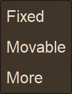
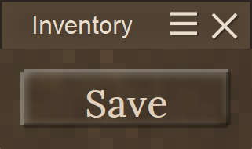

# MVS_UI control reference

Detailed reference for every control in the framework, plus the rules a control has to follow so
the layout stays predictable. For the short version and a quick start, see the
[README](../README.md).

- [How layout works](#how-layout-works)
- [GUI scale](#gui-scale)
- [Events](#events)
- [Render layers and depth](#render-layers-and-depth)
- [CustomDialogElement](#customdialogelement)
- [UIControl](#uicontrol)
- [RectangleControl](#rectanglecontrol)
- [TextLabelControl](#textlabelcontrol)
- [ButtonControl](#buttoncontrol)
- [ContextMenuControl and ContextMenuItem](#contextmenucontrol-and-contextmenuitem)
- [TitleBarControl](#titlebarcontrol)
- [UIManager](#uimanager)
- [Writing a custom control](#writing-a-custom-control)

---

## How layout works

Layout runs in two passes over the tree, started by `PerformLayout()` on the root.

**Measure** (`CalculateSize()`) asks every control how big it wants to be, bottom up. **Arrange**
(`NormalizeChildrenByDelta()` then `CalculateAllPositions()`) stretches children across the
available space, gives them positions and clips whatever leaves the parent.

Three separate sizes keep the two passes from eating each other:

| | written by | read by |
|---|---|---|
| `ExplicitSize` | you, through the `Size` setter | measure, when `IsAutoSize` is false |
| `CalculatedSize` | `CalculateSize()` | the overflow / clipping check |
| `Size` | measure and arrange, through `SetLayoutSize()` | rendering and hit testing |

**The rule, if you write a control:** measure reads `ExplicitSize`, never `Size`. Arrange writes
through `SetLayoutSize()`, never through the `Size` setter. Writing a measured value through the
`Size` setter turns it into an explicit size, and the control then stops measuring itself from the
next pass on - which shows up as boxes that keep an old size while their content is drawn at the
current one.

The pass is idempotent: running it twice on an unchanged tree gives the same result. That is what
makes reopening a dialog and editing it at runtime safe, and `ZLayoutHarness` checks it.

### Stacking direction

`InsideOrientation` decides how a control stacks its **children**:

| value | effect |
|---|---|
| `Top` (default) | children stack downwards, all stretched to the content width |
| `Bottom` | same, positioned from the bottom |
| `Left` / `Right` | children stack sideways, all stretched to the content height |
| `None` | children overlay each other, no stretching |

Careful with the constructors: the parameter named `_Orientation` sets **`InsideOrientation`**, not
the control's own alignment. The `Orientation` property that would be a control's own alignment is
currently never assigned and has no effect - and `Orientation.Fill` is in the enum but not
implemented. Set `InsideOrientation` explicitly when you want to be sure.

### Margin and padding

`Padding` is the inset between a control and its children, `Margin` the gap a control keeps around
itself. Both are in author units and scaled during layout. Measure reserves `2 × Margin` per child;
arrange places the next sibling at `previous.End + previous.Margin + own.Margin`, which comes out
to the same total.

---

## GUI scale

Everything you assign - `Margin`, `Padding`, `Size`, `FontSize`, `LineHeight`, `BorderWidth`,
`RoundedCorners`, `BlurRange` - is in **unscaled author units**. The layout multiplies by
`LayoutScale` on the way to device pixels, exactly like `GuiElement.scaled()` in the vanilla GUI.

After layout, `Position`, `Size` and `CalculatedSize` are **device pixels**. That is what the
renderer and the hit test need, and it is the same space mouse coordinates arrive in, so nothing
has to be transformed back.

`CustomDialogElement` keeps `LayoutScale` in sync with `RuntimeEnv.GUIScale` on every layout, and
`UIManager` watches the `guiScale` setting so open dialogs follow the slider live.

Two things deliberately do **not** scale, because vanilla does not scale them either: the pattern
scale of the dialog background texture, and `GuiStyle.DialogBGRadius`.

---

## Events

Every `UIControl` exposes `Clicked`, `Enter`, `Exit`, `MouseDown`, `MouseUp`, `MouseMove` and
`MouseWheel`. `Clicked` only fires when press and release happened on the same control.

```csharp
button.Enter   += (s, e) => { /* hover in  */ };
button.Exit    += (s, e) => { /* hover out */ };
button.Clicked += (s, e) => { /* e.X, e.Y, e.Button */ };
```

Coordinates in the arguments are **screen** coordinates, while `Position` and `Size` are dialog
local. `UIControl.GetScreenPosition()` converts the other way.

A composite control that should behave as one piece overrides `HitTestRecursive` to return itself -
otherwise the hit test descends into its parts and they receive the events instead:

```csharp
protected override UIControl? HitTestRecursive(UIControl control, double localX, double localY)
{
    return control.ContainsLocalPoint(localX, localY) ? control : null;
}
```

### Mouse capture

Anything that is dragged needs capture, because the cursor leaves the control almost immediately:

```csharp
Dialog?.CaptureMouse(this);      // on MouseDown
// ... all MouseMove now arrives here, wherever the cursor is
Dialog?.ReleaseMouseCapture();   // on MouseUp
```

While a control holds capture, `UIManager` routes movement and the release straight to it - past
the hit test, past the vanilla dialog check and past every other dialog.

---

## Render layers and depth

Two independent things decide what ends up on top.

**Render order** picks the order renderers run in. Vanilla registers its whole GUI in one renderer
at `1.0` in the Ortho stage. Each dialog of ours registers two renderers, one below that band and
one above it, and exactly one of them draws per frame depending on `IsFocused`.

**Depth** decides the rest. The Ortho stage runs with the depth test on and `GlDepthFunc(Lequal)`,
and `ClientMain.OrthoMode` moves the model to `z = -19849` in a frustum of 0.4 to 20001 - so a
larger z is *nearer*. Vanilla stacks its dialogs with `GlTranslate(0, 0, ZSize)` at `ZSize = 150`
each. `IRenderAPI.RenderTexture` defaults to `z = 50`, which is behind almost all of the vanilla
GUI, so drawing later alone does not help. Our renderer passes an explicit z:

| state | z |
|---|---|
| unfocused | 50 - a vanilla dialog covers us |
| focused | 10000 - clear of anything vanilla stacks |
| overlay (popups) | 10100 - above the dialog it belongs to |

A focused dialog therefore also covers the HUD elements, because vanilla draws dialogs and HUDs in
the same renderer.

---

## CustomDialogElement

The root of a tree and the thing that owns a surface, a texture and a place on screen. Children are
laid out in dialog local space with the root at 0/0, which is the space the Cairo surface is drawn
in; the dialog itself then moves to its position on screen.

```csharp
var dialog = new CustomDialogElement(capi, "myDialog", "My Title");
dialog.Children.Add(new TextLabelControl("Hello"));
dialog.Show();
```

| member | meaning |
|---|---|
| `Show()` / `Hide()` / `Toggle()` | lays out, registers with the `UIManager` and draws |
| `ShowAt(x, y)` | opens at a screen position instead of centered |
| `Refresh()` | redraws the surface without laying out again |
| `PerformLayout()` | full layout pass, picks up the current GUI scale |
| `AutoCenter` | re-center on every layout. Off for anything positioned by its opener |
| `DrawsBackground` | the vanilla dialog background. Off gives a transparent surface |
| `IsModal` | swallow clicks on the dialog background too (default on) |
| `CloseOnOutsideClick` | dismiss when a button goes down outside. What makes a popup a popup |
| `PrefersUngrabbedMouse` | keep the cursor free while open (default on) |
| `IsFocused` | set by the `UIManager`; decides whether the dialog draws above vanilla |
| `Layer` | `Normal` or `Overlay`, fixed at construction |
| `CaptureMouse()` / `ReleaseMouseCapture()` | see [Mouse capture](#mouse-capture) |

`Layer` has to be a constructor argument: the game sorts its renderer list when a renderer is
registered and never re-sorts it.

The constructor forces `Padding = 10`. Set it to 0 when the dialog has a title bar, and wrap the
content in a padded container instead - see [TitleBarControl](#titlebarcontrol).

**Dispose it.** The constructor registers renderers with the game; dropping a dialog without
`Dispose()` leaks those and its GL texture.

---

## UIControl

The base class. Useful members beyond the layout ones already covered:

| member | meaning |
|---|---|
| `Children` | observable; adding or removing relays out and redraws the dialog |
| `Parent`, `Dialog` | set by the layout. `Dialog` is null while a subtree is detached |
| `Name` | free-form, yours to use as an id |
| `IsAutoSize` | size follows content instead of an assigned `Size` |
| `LayoutScale` | device pixels per author unit, taken from the root |
| `GetScreenPosition()` | dialog local position plus the dialog position |
| `ContainsLocalPoint(x, y)` | bounds test in dialog local space |
| `PerformLayout()` | full pass, call it on a root |

Building a subtree before adding it to a dialog is fine - `Dialog` simply returns null until it is
attached, and the layout wires everything up on the next pass.

Property changes are **not** observed. After changing text or a colour, call `Dialog?.Refresh()`.

---

## RectangleControl

A box: background fill, per-side borders, optional rounded corners and a Gaussian blur on the
border area. Doubles as the general purpose container, since any control can hold children.

```csharp
var panel = new RectangleControl(
    borderWidth: 2,
    borderColor: new ElementColor(0.0, 0.0, 0.0, 0.5),
    backgroundColor: new ElementColor(GuiStyle.DialogStrongBgColor));

panel.InsideOrientation = Orientation.Top;
panel.Padding = 10;
```

| property | meaning |
|---|---|
| `BackgroundColor`, `BorderColor` | `ElementColor`, constructible from bytes, doubles or a `double[]` |
| `BorderWidth` | stroke width in author units |
| `RoundedCorners` | corner radius; 0 draws square borders |
| `HiddenBorders` | array of `RectangleBorderStyle` sides to leave out |
| `BlurRange`, `BlurEdgeWidth` | blurs the drawn border area, how the embossed look is made |

The blur reads the pixel buffer directly, so a control tree always has to be drawn at the origin of
its own surface. Compositing several trees onto a shared canvas with a context transform smears the
blur across the neighbours.

---

## TextLabelControl

Measures itself from its text and font and draws a single line, or wrapped text when `WordWrap` is
on.

```csharp
var label = new TextLabelControl(
    text: "in between",
    fontName: GuiStyle.StandardFontName,
    fontSize: 16,
    textColor: new ElementColor(GuiStyle.DialogDefaultTextColor),
    orientation: TextOrientation.MiddleLeft,
    padding: 5);
```

`Orientation` here is a `TextOrientation` - `Left`, `Center`, `Right` and the nine
`Top`/`Middle`/`Bottom` combinations - and it hides the inherited `Orientation` on purpose.

Text is measured with `TextExtents.XAdvance`, not `Width`: `Width` is the inked bounding box and
leaves out the side bearings, which makes the box too narrow for the text it holds.

---

## ButtonControl

A composite of a `RectangleControl` for the frame, two more for the embossed light and dark edges,
and a `TextLabelControl` for the caption. Sizes itself to the caption unless given a fixed size.

```csharp
var save = new ButtonControl(_Name: "saveButton");
save.Text = "Save";
save.Clicked += (s, e) => capi.ShowChatMessage("Save clicked");
```


With the cursor on the first one:


A button is an atomic hit target - its parts never receive the events themselves - and it forces
its parts to its own size in three layout overrides, which is the pattern to copy for any composite.

For a fixed size, assign it and turn auto-sizing off. A `PointD(0, 0)` passed to a constructor makes
a control auto-sizing rather than zero sized:

```csharp
button.Size = new PointD(150, 150);
button.IsAutoSize = false;
```

---

## ContextMenuControl and ContextMenuItem

A menu that hangs on another control. The control itself is a **zero sized anchor** inside the host
tree: it costs no layout space, but the layout gives it a position, and that is where the popup goes.
The menu proper lives in its own `CustomDialogElement` in the overlay band, so it can extend past
the host dialog instead of being clipped by its surface.

Because the anchor is part of the tree, its position is recomputed by every layout pass - so
reopening the menu after the host moved or the GUI scale changed lands in the right place without
any tracking.

```csharp
var more = new ContextMenuItem("More", new List<ContextMenuItem>
{
    new ContextMenuItem("Text 1"),
    new ContextMenuItem("Text 2"),
    new ContextMenuItem("Text 3")
});

var menu = new ContextMenuControl(
    button,                                  // adds itself to the owner's children
    new List<ContextMenuItem>
    {
        new ContextMenuItem("Fixed"),
        new ContextMenuItem("Movable"),
        more
    },
    "positionMode",
    ContextMenuAnchor.BottomLeft);

button.Clicked += (s, e) => menu.Toggle();
```




### Reacting to a pick

Subscribe once on the menu. The event bubbles up the cascade, so picks from sub menus arrive here
too and you never have to keep a reference to a single entry:

```csharp
menu.ItemActivated += (sender, e) =>
{
    e.Item;   // the ContextMenuItem that was picked
    e.Text;   // its caption
    e.Path;   // ["More", "Text 2"] - outermost first
};
```

`sender` is the menu the entry actually belongs to, if you care about the level. There is also a
per-entry `ContextMenuItem.Activated` for the rare case where one entry is all you want.

Order on a click: `Activated`, then `ItemActivated` bubbling upwards, then the cascade closes. The
event comes **before** the close, so a handler can still inspect the open menu.

| member | meaning |
|---|---|
| `Show()` / `Hide()` / `Toggle()` | the popup |
| `HideChain()` | closes this menu and every menu it was opened from |
| `Anchor` | which corner of the owner the popup is placed at |
| `Offset` | shift from that corner, for lining up with something inside the owner |
| `Items`, `IsOpen` | |
| `CreateMenuBackground(name)` | the vanilla styled menu box, also used by the harness |

An entry with children is not a command: it opens its sub menu and never raises `Activated`.
Clicking the opener again closes the menu, because `UIManager` consumes that click for the
dismissal.

### Styling

Entries are deliberately **not** buttons. Vanilla menu entries are flat text rows on the shared menu
background, drawn by `GuiElementListMenu` - no border, no emboss, no shadow. The values come
straight from there:

| | value |
|---|---|
| row height | 30 unscaled, independent of the text size |
| text | `sans-serif` 16, `#e9ddce`, left aligned, indent 5 |
| hover | `#a88b6c` across the full row at alpha **0.5** |
| box | `#403529` solid, border `rgba(0,0,0,0.5)` at width 2 |

---

## TitleBarControl

Title, burger menu, close cross - and the handle the dialog is dragged by.

```csharp
dialog.Padding = 0;                                   // the bar has to reach the edges

var titleBar = new TitleBarControl("My Title");
dialog.Children.Add(titleBar);

var content = new RectangleControl();                 // padded container for everything else
content.InsideOrientation = Orientation.Top;
content.Padding = 10;
dialog.Children.Add(content);
```



The bar spans the full width of its parent. Put it in a dialog with `Padding = 0` and wrap the
content below it in a padded container - otherwise the dialog padding insets the bar and it no
longer reaches the edges the way vanilla does.

| member | meaning |
|---|---|
| `Title` | |
| `IsMovable` | drag the dialog by the bar. Also switches `AutoCenter` off, and back on when cleared |
| `CloseRequested` | raised by the cross. Hides the dialog when nothing handles it |
| `Menu` | the Fixed / Movable menu behind the burger, built on first use |

Clicks are dispatched by region: the cross closes, the burger opens the menu, the rest of the bar is
drag surface. Dragging keeps a strip of the dialog on screen so it cannot be pulled out of reach.

Drawn to match `GuiElementDialogTitleBar` step for step, including its quirks: the light inset
stroke is in raw pixels while everything around it scales, and the soft edge comes from blurring the
surface after the stroke rather than from a gradient. The two icons are drawn by the game's own
`IconUtil`, so they are the same shapes vanilla uses rather than a lookalike.

---

## UIManager

One per client session, created by the framework mod. It routes mouse input into the open dialogs
and owns focus.

Input goes through `api.Event.MouseDown` / `MouseUp` / `MouseMove` / `MouseWheelMove`, not through
`ClientPlatformWindows.mouseEventHandlers`. The platform hands every entry in that list its own
freshly allocated `MouseEvent`, so setting `Handled` there cannot stop the game from also
processing the click. `ClientMain` triggers the event API *before* forwarding to its client systems
and aborts as soon as `Handled` is set, so that is the only hook that can actually swallow input.

Routing order per event:

1. a dialog holding mouse capture, if any - it gets everything
2. popups that should be dismissed, topmost first, stopping at the first dialog the click landed in
3. the dialog under the cursor, topmost first

Focus follows the same rule the game applies to its own windows: whoever is drawn on top gets the
click. Clicking one of our dialogs focuses it and brings it above the vanilla GUI; clicking a
vanilla window that covers us drops our focus and we go back below it. A dialog that just opened is
focused.

`UIManager` also watches the `guiScale` setting and re-lays out open dialogs when it changes.

---

## Writing a custom control

```csharp
public class MyControl : UIControl
{
    public override PointD CalculateSize()
    {
        // Measure. Device pixels; scale author units with LayoutScale.
        PointD measured = new PointD(
            ScaledPadding * 2 + 100 * LayoutScale,
            ScaledPadding * 2 + 20 * LayoutScale);

        CalculatedSize = measured;
        SetLayoutSize(measured);
        return measured;
    }

    public override void GenerateRenderData(ImageSurface surface, Context ctx)
    {
        // Position and Size are already device pixels.
        ctx.Rectangle(Position.X, Position.Y, Size.X, Size.Y);
        ctx.Fill();

        base.GenerateRenderData(surface, ctx);   // draws the children
    }
}
```

Rules worth repeating:

- Do not upload anything to the GPU in `GenerateRenderData` - the dialog uploads the finished
  surface exactly once per refresh.
- Measure reads `ExplicitSize`, arrange writes `SetLayoutSize`.
- Override `HitTestRecursive` if the control is one piece.
- Scale everything you drew in author units.
- Add a scenario to `ZLayoutHarness/Scenarios.cs` - it will then be checked for idempotence,
  collapsed controls, sibling overlap and correct scaling, and rendered to PNG.

What the harness cannot cover is anything that only exists at runtime in the game: the Harmony
patches, the real mouse grab, focus and depth against vanilla dialogs, and GPU uploads.
